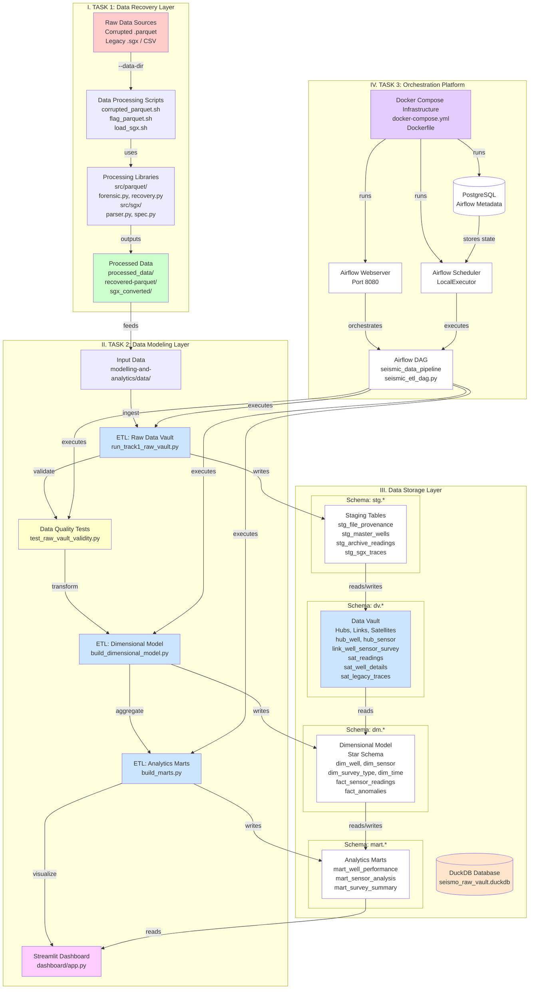

# Seismo-X1 Architecture Diagram

## Overview

This document describes the architecture of the Seismo-X1 project, which processes seismic data through a multi-stage pipeline from raw data recovery to visualization.

## Architecture Diagram

## Component Descriptions

### I. Data Recovery Layer

**Raw Data Sources**
- Corrupted .parquet files
- Legacy .sgx files
- CSV files

**Data Processing Scripts** (`solutions/`)
- `corrupted_parquet.sh`: Recovers corrupted parquet files
- `flag_parquet.sh`: Extracts flags from parquet files
- `load_sgx.sh`: Converts SGX files to parquet format

**Processing Libraries** (`src/`)
- `src/parquet/forensic.py`: Parquet file analysis
- `src/parquet/recovery.py`: Parquet file recovery
- `src/sgx/parser.py`: SGX file parsing
- `src/sgx/spec.py`: SGX file specifications

**Processed Data**
- Output stored in `processed_data/` directory
- Recovered parquet files
- Converted SGX data

### II. Data Modeling Layer

**ETL: Raw Data Vault** (`modelling-and-analytics/etl/run_track1_raw_vault.py`)
- Ingests data from processed sources
- Creates staging tables (stg.*)
- Builds Data Vault structure (dv.*)
- Implements hubs, links, and satellites pattern

**Data Quality Tests** (`modelling-and-analytics/tests/test_raw_vault_validity.py`)
- Validates data integrity
- Checks count reconciliation
- Verifies referential integrity
- Ensures provenance completeness

**ETL: Dimensional Model** (`modelling-and-analytics/etl/build_dimensional_model.py`)
- Transforms Data Vault to star schema
- Creates dimension tables (dim_*)
- Creates fact tables (fact_*)
- Implements time and strata dimensions

**ETL: Analytics Marts** (`modelling-and-analytics/etl/build_marts.py`)
- Aggregates data for analytics
- Creates well performance mart
- Creates sensor analysis mart
- Creates survey summary mart

**Streamlit Dashboard** (`modelling-and-analytics/dashboard/app.py`)
- Visualizes data from marts
- Provides interactive exploration
- Time travel functionality
- Anomaly detection and analysis

### III. Data Storage Layer

**DuckDB Database** (`seismo_raw_vault.duckdb`)
- Single-file analytical database
- Stores all schemas and data

**Schema: stg.* (Staging)**
- Temporary staging area
- Raw data as-is from sources
- File provenance tracking

**Schema: dv.* (Data Vault)**
- Hubs: Business keys (well, sensor, survey_type)
- Links: Relationships between hubs
- Satellites: Descriptive attributes with history

**Schema: dm.* (Dimensional Model)**
- Star schema design
- Dimension tables: well, sensor, survey_type, time, strata
- Fact tables: sensor_readings, survey_events, anomalies

**Schema: mart.* (Analytics Marts)**
- Pre-aggregated analytics tables
- Optimized for dashboard queries
- Well performance metrics
- Sensor reliability analysis
- Survey summaries

### IV. Orchestration Platform

**Docker Compose Infrastructure**
- Containerized environment
- Defined in `docker-compose.yml`
- Custom Dockerfile for Airflow

**PostgreSQL**
- Stores Airflow metadata
- Tracks DAG runs and task states
- Maintains execution history

**Airflow Webserver**
- Web UI on port 8080
- DAG visualization and monitoring
- Task execution control

**Airflow Scheduler**
- Executes DAGs using LocalExecutor
- Manages task dependencies
- Coordinates workflow execution

**Airflow DAG** (`modelling-and-analytics/dags/seismic_etl_dag.py`)
- Defines pipeline workflow
- Orchestrates ETL tasks in sequence:
  1. Ingest Raw Vault
  2. Test Raw Vault Validity
  3. Build Dimensional Model
  4. Build Analytics Marts

## Data Flow

1. **Recovery**: Raw corrupted/legacy files → Processing scripts → Libraries → Processed data
2. **Ingestion**: Processed data → Raw Vault ETL → Staging tables → Data Vault
3. **Validation**: Data Vault → Quality tests → Validation results
4. **Transformation**: Data Vault → Dimensional Model ETL → Star schema
5. **Aggregation**: Dimensional Model → Analytics Marts ETL → Pre-aggregated marts
6. **Visualization**: Analytics Marts → Streamlit Dashboard → User interface

## Execution Flow

The Airflow DAG orchestrates the entire pipeline:
1. `ingest_raw_vault` → Loads data into Data Vault
2. `test_raw_vault_validity` → Validates data quality
3. `build_dimensional_model` → Creates dimensional model
4. `build_marts` → Builds analytics marts

Each step depends on the previous one completing successfully.
